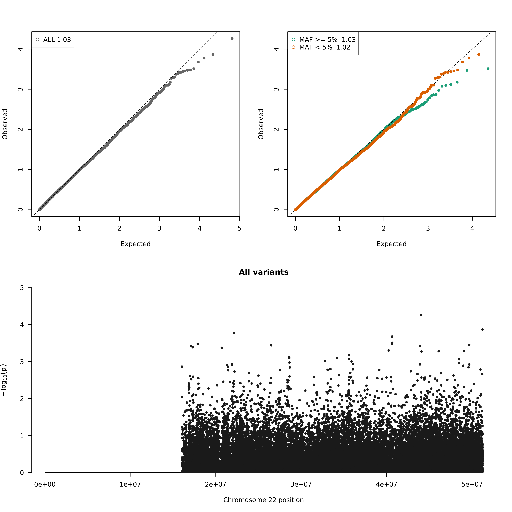

# Single Variant Association -- Mixed Models

## Description 

This workflow implements a single variant association analysis of genotype data with a single trait using mixed models. The primary code is written in R using the GENESIS package for model fitting and association testing. The workflow can either generate a null model from traits and covariates and a genetic related matrix or use a pre-generated null model obtained from GENESIS.

Also included is a workflow for regenerating the final summary results of the single variant association pipeline. This summary workflow takes a CSV file of association results (with the same format of the final summary output) and regenerates plots and output files.

### Authors

This workflow is produced and maintained by the [Manning Lab](https://manning-lab.github.io/). Contributing authors include:

* Tim Majarian (tmajaria@broadinstitute.org)
* Jasen Jackson (jasenjackson97@gmail.com)
* Alisa Manning (amanning@broadinstitute.org).

## Dependencies

### Workflow execution

* [WDL](https://software.broadinstitute.org/wdl/documentation/quickstart)
* [Cromwell](http://cromwell.readthedocs.io/en/develop/)

### R packages

All code and necessary packages are available through a [Docker image](https://hub.docker.com/r/manninglab/singlevariantassociation/) as well as through the [Github repository](https://github.com/manning-lab/singleVariantAssociation).

* [GENESIS](https://www.bioconductor.org/packages/release/bioc/html/GENESIS.html)
* [GWASTools](https://www.bioconductor.org/packages/release/bioc/html/GWASTools.html)
* [SeqArray](https://www.bioconductor.org/packages/release/bioc/html/SeqArray.html)
* [SeqVarTools](https://www.bioconductor.org/packages/release/bioc/html/SeqVarTools.html)
* [dplyr](https://dplyr.tidyverse.org/)
* [tidyr](https://tidyr.tidyverse.org/)
* [stringr](https://cran.r-project.org/web/packages/stringr/vignettes/stringr.html)
* [RColorBrewer](https://cran.r-project.org/web/packages/RColorBrewer/RColorBrewer.pdf)
* [data.table](https://cran.r-project.org/web/packages/data.table/index.html)
* [qqman](https://cran.r-project.org/web/packages/qqman/index.html)

## Main Functions

### preprocess_conditional.R
This script preprocesses the phenotype file for a conditional analysis on some snps, extracting the genotype information and adding to the phenotypes for each sample.

Inputs:
* genotype_files : comma separated list of gds file paths, this list must contain gds files for every snp (file, GDS)
* *phenotype_file* : phenotype file to be edited (file, CSV/TSV)
* *id_col* : column name in the phenotype file that holds the individual sample ids (string)
* *sample_file* : text file with list of sample ids to include, one per line (file, TXT)
* *snps* : comma separated list with the form chr_number:position,chr_number:position (string)

Outputs :
* new_phenotype_file : phenotype.data input with appended dosage columns for snps of interest (.csv)
* alt_ref : text file with alternate and reference alleles for each snp of interest (.txt)
* log_file : log file containing paths to inputs and memory and cpu usage

### genesis_nullmodel.R

This script generates a null model to be used in association testing in Genesis

Inputs:
* genotype_files : genotype data for all samples (array of VCF or GDS file)
* *phenotype_file* : phenotype data for all samples to be included in analysis (CSV or TSV file)
* *outcome_name* : the outcome to be tested (string)
* *outcome_type* : the type of outcome being tested (dichotomous or continuous)
* *covariates_string* : covariates to condition on in linear mixed modeling (comma separated string, default = '')
* *conditional_string* : variant to condition on in string format (chr#:position)
* *ivars_string* : comma separated list of interaction variants found in phenotype file (string)
* *group_var* : variable for running with heterogeneous variances (string)
* *sample_file* : a file containing a list of sample ids (matching the genotype and phenotype files) to be included, one per line (.txt)
* label : prefix for output filename (string)
* *kinship_file* : relatedness measures for all samples (CSV or TSV file)
* id_col : column name of id column in phenotype file (string)

Outputs:
* model : generated null model (.RDa)
* log_file : log file containing paths to inputs and memory and cpu usage

### association.R

This script performs an association test to generate p-values for each variant included.

Inputs:
* gds_file : a genotype file containing data for all samples are variants to be tested (file, GDS)
* null_file : output of the task fitNull or a pregenerated null model (file, RDa)
* label : prefix for output filename (string)
* *test* : statistical test (Score or Wald, default = Score)
* *ivars_string* : comma separated list of interaction variants found in phenotype file (string)
* *mac* : minimum minor allele count for variants to be included in analysis (int, default = 5)
* *variant_range* : A tab separated file of variant ranges to restrict to, one per line (TSV)

Outputs:
* assoc : an RData file of associations results (RData)
* log_file : log file containing paths to inputs and memory and cpu usage

### summary.R

Generate a summary of association results including quantile-quantile and manhattan plots for variants subseted by minor allele frequency (all variants, maf < 5%, maf >= 5%). Also generates CSV files of all variants and variants with P < pval_threshold.

Inputs:
* pval : the p-value column in the output of assocTest, this should be the statistical test with ".pval" appended (string, Score -> Score.pval, Wald -> Wald.pval)
* *pval_threshold* : p-value threshold for the returning top associations, top association output will include only variants with a p-value less than the threshold (float, default = 0.0001)
* label : prefix for output filename (string)
* assoc : output of assocTest (Array[RData])

Outputs:
* allassoccsv : association results for all variants (CSV)
* topassoccsv : association results for variants passing pvalue threshold (CSV)
* plots : manhatten and QQ plots (PNG)
* log_file : log file containing paths to inputs and memory and cpu usage

### Other workflow inputs

* this_fitNull_memory : amount of memory in GB for fitNull task (int)
* this_assocTest_memory : amount of memory in GB for assocTest task (int)
* this_summary_memory : amount of memory in GB for summary task (int)
* this_disk : amount of disk space in GB to allot for each execution of a task (int)

## Workflow Outputs

The main outputs of the single variant association workflow come from *summary.R*. Two CSV files are produced:

- All association results - analysis results for every variant tested
- Top association results - analysis results for only those variants passing a pvalue threshold

Each of these files have a single row for each variant included (multi-allelics are split with a single row per alternate allele). Each file has a minimum set of columns with a few extra columns that depend on the type of association test performed. The columns that are always present in both output CSV files are:

```
1. MarkerName: a unique identifier of the variant with the format: `chromosome-position-reference_allele-alternate_allele`, ex: `chr1-123456-A-C` (string)
2. chr: chromosome of the variant (string)
3. pos: position of the variant (int)
4. ref: reference allele of the variant as encoded in the input GDS file (string)
5. alt: alternate allele of the variant as encoded in the input GDS file (string)
6. minor.allele: allele with lowest MAF, allele tested in association analysis, relevant if a direction of effect is to be considered (string: either `alt` or `ref`)
7. maf: frequency of `minor.allele` in sample tested for association (float)
8. pvalue: pvalue generated in association analysis (float)
9. n: number of samples used in generated association statistics (int)
```

If the trait of interest is dichotomous:

```
10. homref.case: number of homozygous reference cases (int)
11. homref.control: number of homozygous reference controls (int)
12. het.case: number of heterozygous reference cases (int)
13. het.control: number of heterozygous reference controls (int)
14. homalt.case: number of homozygous alternate cases (int)
15. homalt.control: number of homozygous alternate controls (int)
```

If the statistical test is the Score test:

```
16. Score.stat: score statistic of the variant (float)
```

If the statistical test is the Wald test:

```
9. Wald.Stat: Wald statistic of the variant (float)
```

| MarkerName          | chr | pos | ref | alt | minor.allele | maf | pvalue | n | Score.Stat | homref.case | homref.control | het.case | het.control | homalt.case | homalt.control |
| --- | --- | --- | --- | --- | --- | --- | --- | --- | --- | --- | --- | --- | --- | --- | --- |
| `chr22-16052271-G-A` | 22 | 16052271 | G | A | alt | 0.00758785942492013 | 0.0598677318862846 | 2504 | 3.54104500175231 |  |  |  |  |  |  |
| `chr22-16052986-C-A` | 22 | 16052986 | C | A | alt | 0.0740814696485623 | 0.00136321342450303 | 2504 | 10.2549092079464 |  |  |  |  |  |  |
| `chr22-16911246-C-T` | 22 | 16911246 | C | T | alt | 0.0229632587859425 | 0.00493797826230611 | 2504 | 7.90201415125622 | 485 | 1909 | 11 | 94 | 0 | 5 |
| `chr22-17008128-C-T` | 22 | 17008128 | C | T | alt | 0.00219648562300319 | 0.507497926757033 | 2504 | 0.439222569581943 |  |  |  |  |  |  |
| `chr22-17008980-C-T` | 22 | 17008980 | C | T | alt | 0.0658945686900958 | 0.753724036726461 | 2504 | 0.0984282285639501 |  |  |  |  |  |  |
| `chr22-17009923-G-C` | 22 | 17009923 | G | C | alt | 0.0119808306709265 | 0.00240701549344414 | 2504 | 9.20996306542171 | 475 | 1969 | 21 | 39 | 0 | 0 |


*summary.R* also produces a PNG file with Manhattan and quantile-quantile plots. Three plots are shown in this image (from top-left):

1. QQ plot of all variants
2. QQ plot of variants divided into *Common variants* with MAF >= 5% and *Low frequency and rare variants* with MAF < 5%. Genomic control is shown at top left of each plot.
3. Manhattan plot of all variants with nominal (1e-5) and genomewide (5e-8) significance thresholds in blue and red lines respectively.




